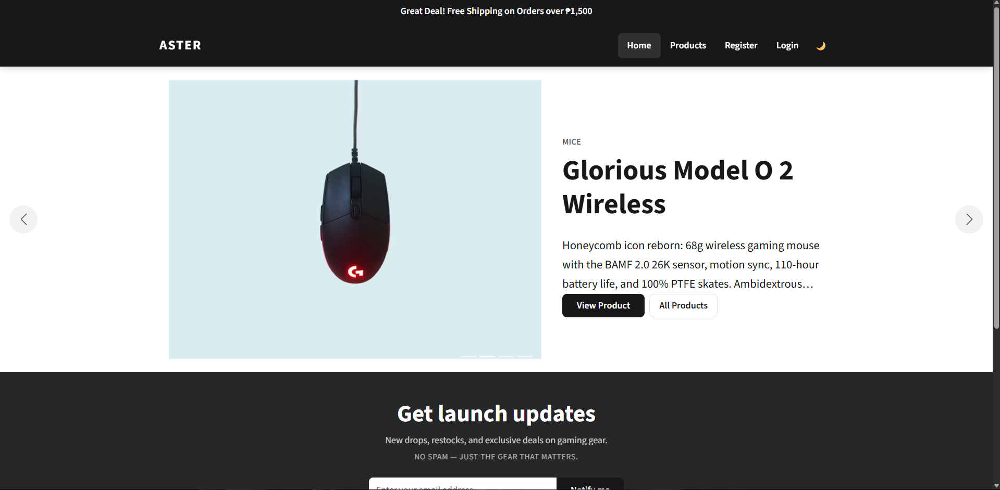
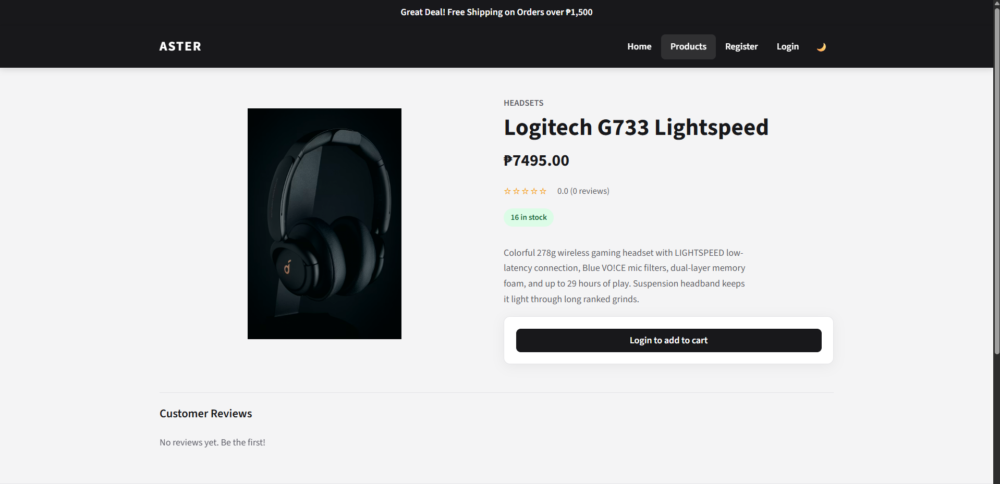
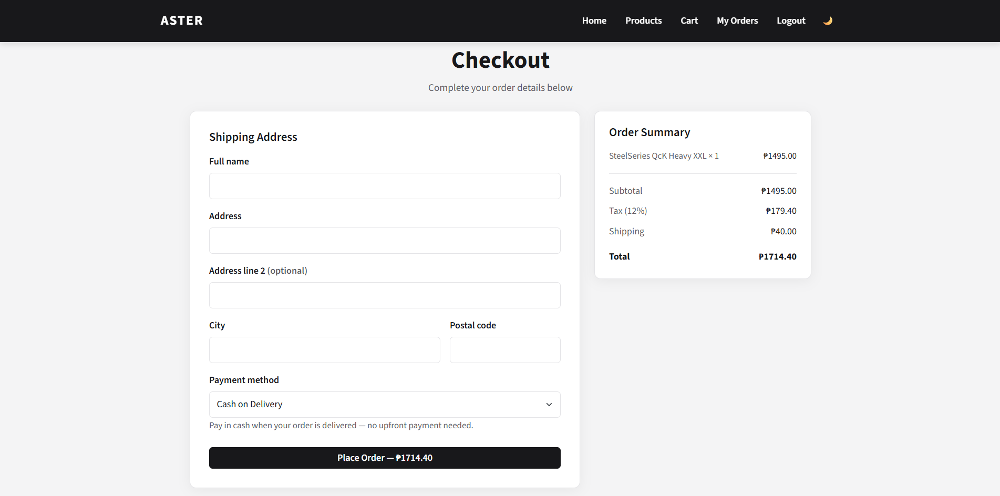
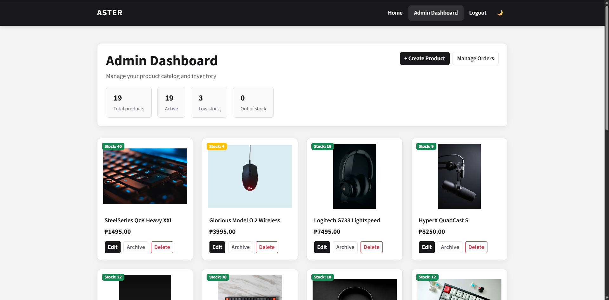
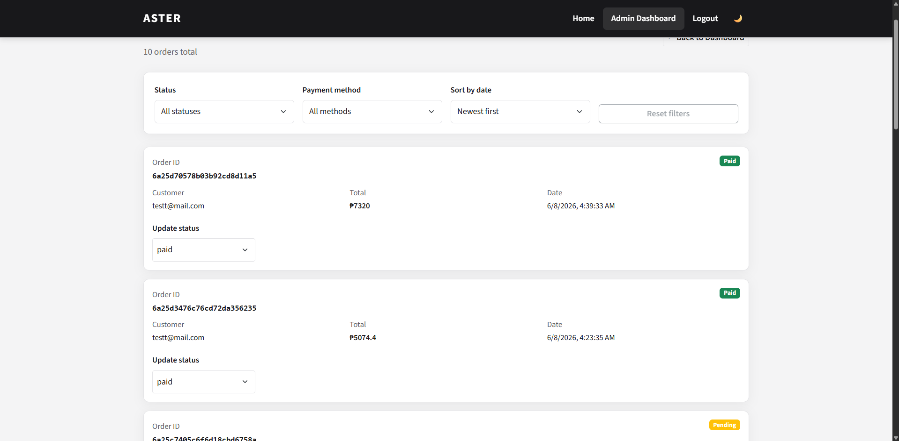

# ASTER E-Commerce

Full-stack MERN e-commerce application built as a freelance portfolio project. Features product catalog, cart, JWT auth with admin RBAC, Philippine payment options (COD plus PayMongo GCash, GrabPay, QRPh), order management, reviews, and search.

**Live demo:** [aster-olive.vercel.app](https://aster-olive.vercel.app) · **API health:** [ecommerce-app-5lsn.onrender.com/health](https://ecommerce-app-5lsn.onrender.com/health)

> The API runs on Render's free tier — the first request after idle may take ~30 seconds to wake.

## Screenshots

| Storefront | Product detail |
|---|---|
|  |  |

| Checkout (PH payments) | Admin dashboard |
|---|---|
|  |  |


*Admin order management: filter by status/payment method and update order status.*

## Try the demo

1. **Register** any account (or log in) — auth uses httpOnly cookies, nothing in `localStorage`.
2. **Browse** the catalog, search by name or price, open a product, leave a review.
3. **Add to cart → Checkout** with a PH shipping address.
4. Pick **QRPh / GCash / GrabPay** — you'll be redirected to PayMongo's hosted checkout running in **test mode** (no real money moves). Complete the test payment and watch the order flip from *Pending* to *Paid* automatically via webhook. Or pick **COD** for the offline flow.
5. **Admin dashboard** (product CRUD, Cloudinary image uploads, stock stats, order status management) — demo credentials available on request; admin screenshots above.

## Challenges solved

- **Cross-origin cookie auth in production.** The SPA (Vercel) and API (Render) live on different domains, so the JWT cookie is issued `httpOnly; Secure; SameSite=None` in production while staying `Lax` for local dev — login works in both without touching `localStorage`.
- **Webhook-driven payment confirmation.** Orders are marked paid only by PayMongo's signed `checkout_session.payment.paid` webhook (HMAC-verified against the raw request body, mounted before the JSON body parser), never by the client redirect — so a user closing the tab can't desync payment state, and replayed events are idempotent.
- **Test-mode vs live-mode webhooks.** PayMongo registers webhooks per mode; diagnosing why test payments produced zero deliveries (the webhook existed only in live mode) is documented in [docs/DEPLOYMENT.md](docs/DEPLOYMENT.md).
- **PaaS proxy correctness.** Render terminates TLS at a reverse proxy, so Express trusts the first hop (`trust proxy`) to keep per-IP rate limiting accurate.

## Tech decisions

- **Vite + TanStack Query** over CRA/Redux: instant dev server, and server-state caching/polling (e.g. the order-success page polls until the webhook marks the order paid) without boilerplate.
- **httpOnly cookie JWT** over `localStorage`: tokens are unreachable from JavaScript, which neutralizes XSS token theft; CSRF exposure is bounded by `SameSite` + strict CORS.
- **Hosted checkout + webhook** over client-side confirmation: PayMongo owns card/e-wallet UX and PCI scope; the server is the single source of truth for payment state.

## Stack

- **Frontend:** React 18, Vite, React Router, TanStack Query, Bootstrap
- **Backend:** Node.js, Express, Mongoose, JWT
- **Database:** MongoDB
- **Payments:** Cash on Delivery plus PayMongo hosted checkout (GCash, GrabPay, QRPh)

## Project structure

```
ecommerce-app/
├── client/          # Vite React app (port 5173)
├── server/          # Express API (port 4000)
└── package.json     # Run both with `npm run dev`
```

## Quick start

### Prerequisites

- Node.js 18+
- MongoDB (local or [MongoDB Atlas](https://www.mongodb.com/atlas))

### 1. Install dependencies

```bash
npm run install:all
```

### 2. Configure environment

**server/.env** (copy from `server/.env.example`):

```env
PORT=4000
MONGODB_STRING=mongodb://127.0.0.1:27017/aster-ecommerce
SECRET=your_jwt_secret_here
CLIENT_URL=http://localhost:5173
NODE_ENV=development
SEED_ADMIN_EMAIL=admin@aster.dev
SEED_ADMIN_PASSWORD=Admin1234!
```

**client/.env** (copy from `client/.env.example`):

```env
# Leave empty in development — the Vite dev server proxies API paths to the
# backend so the httpOnly auth cookie stays same-origin. Set to the production
# API origin only when the client is served from a different domain.
VITE_API_URL=
```

### 3. Seed admin user and demo catalog

Creates the admin account plus 9 demo gaming products (idempotent — safe to re-run).

```bash
npm run seed
```

### 4. Run development

```bash
npm run dev
```

- Storefront: http://localhost:5173
- API: http://localhost:4000/health

## Checkout flow

All orders go through `POST /orders` with a chosen payment method:

- **COD** — order is placed as `pending`; pay on delivery
- **GCash / GrabPay / QRPh** — order is placed as `pending`, then the shopper is redirected to a PayMongo hosted checkout (`POST /payments/checkout`). PayMongo notifies the server via webhook (`POST /webhooks/paymongo`), which marks the order `paid`

Online payments require `PAYMONGO_SECRET_KEY` and `PAYMONGO_WEBHOOK_SECRET` (use test keys first). Without them, only Cash on Delivery is available. Webhooks need a public URL — use a tunnel such as ngrok or cloudflared pointing to `/webhooks/paymongo` for local testing, and note that **webhooks are registered per mode** (a test-mode key needs a test-mode webhook). See [docs/DEPLOYMENT.md](docs/DEPLOYMENT.md).

## Security

- **httpOnly cookie auth** — the JWT is set as an `httpOnly` cookie on login (never stored in `localStorage`), so it is not reachable from JavaScript. It is cleared by `POST /users/logout`. In development the cookie is `SameSite=Lax` over `http://localhost`; in production (`NODE_ENV=production`) it is `Secure; SameSite=None` so the cross-origin SPA (Vercel) can authenticate against the API (Render).
- **Helmet** sets hardened HTTP response headers.
- **CORS** is restricted to `CLIENT_URL` with credentials enabled.
- **Rate limiting** — a global limit plus stricter limits on auth endpoints (`/users/login`, `/users/register`) and order creation (`POST /orders`). Express trusts the first proxy hop so per-IP limits work behind Render's reverse proxy.
- **Webhook signature verification** — PayMongo events are HMAC-verified against the raw request body before any order state changes.
- The Vite dev server proxies API paths to the backend so cookies remain same-origin during local development.

## API overview

| Resource | Endpoints |
|----------|-----------|
| Users | `POST /users/register`, `POST /users/login`, `POST /users/logout`, `GET /users/details` |
| Products | `GET /products`, `GET /products/all`, `PATCH /products/:id/archive` |
| Cart | `GET/POST /carts`, `PUT /carts/quantity`, `PATCH /carts/clear` |
| Orders | `POST /orders`, `GET /orders/authenticatedorder`, `PATCH /orders/:id/cancel` |
| Payments | `POST /payments/checkout`, `POST /webhooks/paymongo` |

## Deployment

| Service | Host (live demo) |
|---------|------------------|
| Client (static) | Vercel — `vercel.json` builds the client workspace; set `VITE_API_URL` to the API origin |
| API | Render — set `NODE_ENV=production`, `CLIENT_URL`, PayMongo keys |
| Database | MongoDB Atlas |

Full walkthrough including PayMongo webhook setup: [docs/DEPLOYMENT.md](docs/DEPLOYMENT.md)

## Testing

```bash
npm test
```

Covers order utilities, the API health endpoint, the client API wrapper, and the PayMongo webhook handler (signature rejection, event filtering, idempotent pending→paid transition). CI runs server tests and the client build/tests on every push ([.github/workflows/ci.yml](.github/workflows/ci.yml)).

## Portfolio highlights

- Reconciled legacy API with modern Vite + TanStack Query client
- Stock validation on cart and checkout
- Philippine-focused payments: COD plus PayMongo hosted checkout (GCash, GrabPay, QRPh) with signed, idempotent webhooks
- Cross-origin cookie auth between Vercel and Render in production
- Admin order status management with Cloudinary product uploads
- Product search, filters, reviews, and dark mode

## License

MIT
